# VPN-for-VPC-Client-to-Site :computer:


<br />

## Tabla de contenido 📑

1. [Requisitos](#Requisitos-newspaper)
2. [Antes de empezar](#antes-de-empezar)
   * [Configuración de la autenticación client-to-site e importación de certificados al Certificate Manager](#configuración-de-la-autenticación-client-to-site-gear)
   * [Creación del grupo de acceso IAM y rol para conectarse al servidor VPN](#creación-del-grupo-de-acceso-iam-y-rol-para-conectarse-al-servidor-vpn-oldkey)
   * [Creación de la VPC y la subred](#creación-de-la-vpc-y-la-subnet)
3. [creación del servidor VPN](#desplegar-servidor-vpn)
   * [Crear servidor VPN](#h3crear-servidor-vpnh3)
   * [Validar servidor VPN](#validar-servidor-vpn)
   * [Crear ruta VPN](#crear-ruta-vpn)
   *[Configurar Protocolo y reglas de entrada](#configurar-protocolo-y-reglas-de-entrada)
   * [Configurar cliente de VPN](#configurar-el-cliente-de-vpn)
4. [Autenticación al servidor VPN](#autenticación-al-servidor-vpn)
5. [Referencias](#Referencias-mag)
6. [Autores](#Autores-black_nib)
<br />

## Requisitos :newspaper:
- Contar con un sistema operativo Linux con el navegador Google Chrome instalado

- Tener una cuenta de [IBM Cloud](https://cloud.ibm.com/)

- :cloud: [IBM Cloud CLI](https://cloud.ibm.com/docs/cli?topic=cloud-cli-getting-started&locale=en)

- :satellite: [OpenVPN](https://openvpn.net/)
- [Git](https://git-scm.com/downloads)

## Antes de empezar
Inicie sesión en su cuenta de [IBM Cloud](https://cloud.ibm.com/login).
## Configuración de la autenticación client-to-site :gear:
**Crear una autorización IAM sevice-to-service**
<br/>
Para crear una autorización IAM sevice-to-service para su servidor VPN y certificate manager siga los siguientes pasos:
1. Desde la consola de IBM Cloud, vaya a la página [Manage Autorizations](https://cloud.ibm.com/iam/authorizations) y dé clic en el botón ```Create```
2. En el menú desplegable seleccione ```VPC Infrastructure Services``` y luego seleccione ```Resource based on selected attributes```
3. Seleccione ```Resource type``` > ```Client VPN for VPC```
4. En la opción Target Service seleccione ```Certificate Manager```
5. Seleccione la opción ```All resources``` y verifique la casilla ```Writer```
6. Dé clic en ```Authorize```

**Gestión de certificados de cliente y servidor VPN**
<br/>
Para la gestión de certificados hay dos opciones, usar OpenVPN para generar los certificados u ordenar un certificado usando Certificate Manager.

**Opción 1. Generación de certificados usando OpenVPN**
<br/>
A continuación se usará [OpenVPN easy-rsa](https://github.com/OpenVPN/easy-rsa) para generar los certificados y posteriormente importarlos al certificate manager.
1. Clone el repositorio Easy-RSA 3 en su carpeta local:

```
git clone https://github.com/OpenVPN/easy-rsa.git
cd easy-rsa/easyrsa3
```

2. Cree un nuevo PKI y CA:

```
./easyrsa init-pki
./easyrsa build-ca nopass
```

Verifique que el certificado CA esté generado en la ruta ```./pki/ca.crt```

3. Genere un certificado de servidor VPN:

```
./easyrsa build-server-full vpn-server.vpn.ibm.com nopass
```

Verifique que la llave pública haya sido generada en la ruta ```./pki/issued/vpn-server.vpn.ibm.com.crt``` y la llave privada en la ruta ```./pki/private/vpn-server.vpn.ibm.com.key```

4. Genere un certificado de cliente VPN:
```
./easyrsa build-client-full client1.vpn.ibm.com nopass
```
Verifique que la llave pública haya sido generada en la ruta ```./pki/issued/client1.vpn.ibm.com.crt``` y la llave privada en la ruta ```./pki/private/client1.vpn.ibm.com.key```
<br/>

Para importar el certificado del servidor al certificate manager siga estos pasos:
1. En el navegador Google Chrome diríjase a la página de [Certificate Manager](https://cloud.ibm.com/catalog/services/certificate-manager), complete la información y dé clic en ```Create``` para crear una instancia.
2. Diríjase a la página ```Your Certificates``` e importe el certificado del servidor según los siguientes pasos:

   * Elija un nombre para su certificado, este no puede contener guiones, números ni mayúsculas (ej. vpcdemo)
   * Dé clic al botón ```Browse``` y seleccione el archivo de certificado ```./pki/issued/vpn-server.vpn.ibm.com.crt```
   * Dé clic al botón ```Browse``` y seleccione el archivo de llave privada ```./pki/private/vpn-server.vpn.ibm.com.key```
   * Dé clic al botón ```Browse``` y seleccione el archivo de certificado intermediario ```./pki/ca.crt```
   * Dé clic al botón ```Import```
   <br/>

<br/>

**Opción 2. Ordenar un certificado usando Certificate Manager**
<br/>

Usted puede usar IBM Cloud Certificate Manager para ordenar un certificado público SSL/TLS como certificado de servidor VPN. Certificate Manager solo almacena certificados intermedios, por lo cual usted necesitará los root certificates de Let's Encrypt, guardados como archivos ```.pem```. Los dos archivos requeridos puede encontrarlos en [https://letsencrypt.org/certs/lets-encrypt-r3.pem](https://letsencrypt.org/certs/lets-encrypt-r3.pem) y [https://letsencrypt.org/certs/isrgrootx1.pem](https://letsencrypt.org/certs/isrgrootx1.pem). Cuando descargue y actualice el certificado de cliente VPN, use este root certificate para reemplazar la sección ```<ca>``` en el perfil de cliente.
<br/>

Los certificados ordenados son certificados públicos SSL/TLS y deben ser usados como certificados de servidor VPN únicamente. No deben ser usados para autenticar los clientes VPN.
<br/>

*Ubicar el certificado CRN*
<br/>

Al configurar la autenticación de un servidor VPN client-to-site usando la UI, usted puede especificar el Certificate Manager y el certificado SSL, o el CRN del certificado. Esto se puede hacer si usted no tiene acceso a la instancia de Certificate Manager. Tenga en cuenta que usted debe ingresar el CRN si está usando la API para crear el servidor VPN client-to-site.
<br/>
Para encontrar el CRN del certificado, siga estos pasos:

1. En la [consola de IBM Cloud](https://cloud.ibm.com/vpc-ext) Vaya al ícono de menú y seleccione ```Resource List```
2. Dé clic para expandir ```Services and software``` y posteriormente seleccione el Certificate Manager del que desea obtener el CRN.
3. Seleccione cualquier parte en esa fila de la tabla para abrir el panel lateral de detalles. El CRN del certificado se encuentra listado allí.

## Creación del grupo de acceso IAM y rol para conectarse al servidor VPN :old_key:

Para crear un grupo de acceso IAM y permitir al rol de usuario conectarse al servidor VPN, siga estos pasos:

1. Desde la consolda de IBM Cloud, navegue a la página de [Access groups](https://cloud.ibm.com/iam/groups) (Manage > Access (IAM) > Access groups) y dé clic en ```Create```.
2. Digite un nombre para su grupo de acceso y dé clic en ```Create```.
3. Dé clic en la pestaña ```Access Policies``` y luego en ```Assign access```.
4. En el menú desplegable seleccione ```VPC Infrastructure Services```.
5. Para acceso al servicio, seleccione ```Users of the VPN server need this role to connect to the VPN server``` y luego dé clic en ```Add```
6. Verifique el panel de resumen y dé clic en ```Assign```.
7. Dé clic en la pestaña ```Users``` y posteriormente en ```Add users``` para agregar usuarios al nuevo grupo de acceso.

## Creación de la VPC y la subnet

**Creación de la VPC**
<br/>
Para crear una VPC en su cuenta de IBM Cloud siga los pasos que se indican a continuación:

1. Dé click en el Menú de Navegación y seleccione la pestaña ```VPC Infrastructure```.

2. En la sección de ```Network``` seleccione la opción ```VPCs``` y posteriormente de click en el botón ```Create```. Una vez le aparezca la ventana para la configuración y creación de la *VPC*, complete lo siguiente:

* ```Name```: asigne un nombre exclusivo para la *VPC*.
* ```Resource Group```: seleccione el grupo de recursos en el cual va a trabajar.
* ```Location```: seleccione la ubicación en la cual desea implementar la *VPC*.


| NAME | DISPLAY NAME |
| ------------- | :---: |
| au-syd        | Sydney          |     
| in-che        | Chennai         |     
| jp-osa        | Osaka           |     
| jp-tok        | Tokyo           |     
| kr-seo        | Seoul           |     
| eu-de         | Frankfurt       | 
| eu-gb         | London          | 
| ca-tor        | Toronto         |     
| us-south      | Dallas          | 
| us-south-test | Dallas Test     |
| us-east       | Washington DC   |
| br-sao        | Sao Paulo       |

* ```Default security group```: deje seleccionadas las opciones *Permitir SSH* y *Permitir ping*.
* ```Classic access```: deje el campo SIN seleccionar.
* ```Default address prefixes```: deje el campo SIN seleccionar, ya que posteriormente se creará la subred en la que se va a trabajar.

Cuando ya tenga todos los campos configurados dé click en el botón ```Create virtual private cloud```.

3. Espere unos minutos mientras la *VPC* aparece en estado disponible y asegúrese de tener seleccionada la región en la cual la implementó.
4. Una vez haya sido aprovisonada la VPC, dé click en el nombre e ingrese a la pestaña ```Address prefixes```. En dicha pestaña, de click en ```Create``` e ingrese la dirección IP que desee junto con la máscara.

> NOTA: Puede utilizar la IP y máscara sugeridas en las subnets creadas por defecto cuando se estaba aprovisionando la VPC.

<br />

**Creación de la subnet**
<br />
El siguiente paso consiste en crear una Subnet en la *VPC*. Para ello, en la sección ```Network``` seleccione la opción ```Subnets``` y dé click en el botón ```Create```. Una vez le aparezca la ventana para la configuración y creación de la subnet, complete lo siguiente:

* ```Name```: asigne un nombre exclusivo para la subnet.
* ```Resource group```: seleccione el grupo de recursos en el cual va a trabajar (el mismo seleccionado en la creación de la *VPC*).
* ```Location```: seleccione la ubicación en la cual desea implementar la subnet (la misma seleccionada en la creación de la *VPC*).
* ```Virtual private cloud```: seleccione la *VPC* que creó anteriormente.
* Los demás parámetros no los modifique, deje los valores establecidos por defecto.

Cuando ya tenga todos los campos configurados dé click en el botón ```Create subnet```.

Luego de crear la subnet habilitar la opcion de pasarela publica.

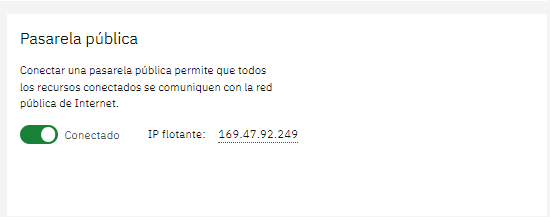

6. Espere unos minutos mientras la subnet aparece en estado disponible y asegúrese de tener seleccionada la región en la cual la implementó.

<br />

## Configurar claves SSH :closed_lock_with_key:
<br />
Para poder desplegar una *VSI* en *VPC* es necesario realizar la respectiva configuración para las claves *SSH*. Con base en esto, realice lo siguiente:

1. Para generar una clave *SSH* acceda al *IBM Cloud Shell* y coloque el comando:
```
ssh-keygen -t rsa -C "user_id"
```

2. Al colocar el comando anterior, en la consola se pide que especifique la ubicación, en este caso oprima la tecla Enter para que se guarde en la ubicación sugerida. Posteriormente, cuando se pida la ```Passphrase``` coloque una constraseña que pueda recordar o guárdela, ya que se utilizará más adelante.

3. Muévase con el comando ```cd .ssh``` a la carpeta donde están los archivos ```id_rsa.pub``` y ```id_rsa```. Estos archivos contienen las claves públicas y privadas respectivamente. 

4. Visualice la clave pública, ya que la necesitará para la creación de la *VSI*. Utilice el comando:
```
cat id_rsa.pub
```
> NOTA: Por defecto la clave empieza con ssh_rsa y termina con el user_ID. Copie la clave para emplearla más adelante.

<br />

**Desplegar VSI en VPC**
<br/>
Una vez ha configurado las claves *SSH* proceda con la creación de la *VSI* Linux en *VPC*. Complete los siguientes pasos:

1. Entre al menú desplegable y seleccione ```VPC Infrastructure```. En la sección de ```Compute``` seleccione la opción ```Virtual Server instances``` y posteriormente dé click en el botón ```Create```. Una vez le aparezca la ventana para la configuración y creación de la *VSI*, complete lo siguiente:

* ```Name```: asigne un nombre exclusivo para la *VSI*.
* ```Resource group```: seleccione el grupo de recursos en el cual va a trabajar (el mismo seleccionado en la creación de la *VPC*).
* ```Location```: seleccione la ubicación en la cual desea implementar la subnet (la misma seleccionada en la creación de la *VPC*).
* ```Hosting type```: seleccione la opción **Public**.
* ```Operating system```: seleccione la opción **Ubuntu Linux**.
* ```Profile```: deje seleccionado el perfil que viene por defecto (**Balanced | bx2-2x8**).
* ```SSH keys```: dé click en el botón ```Create key +```, asigne un nombre exclusivo para su clave *SSH*, seleccione el grupo de recursos y la ubicación y finalmente en **Public key** coloque la clave copiada en el ítem 3 del paso [Configurar claves SSH](#Configurar-claves-SSH-closed_lock_with_key). Posteriormente, dé click en el botón ```Create```.
* ```Virtual private cloud```: seleccione la *VPC* creada anteriormente.
* Los demás parámetros no los modifique, deje los valores establecidos por defecto.

Cuando ya tenga todos los campos configurados dé click en el botón ```Create virtual server instance```.

2. Espere unos minutos mientras la *VSI* aparece en estado disponible y asegúrese de tener seleccionada la región en la cual la implementó.

<br />

## Desplegar servidor VPN
Diríjase al Panel en la parte izquierda de IBM Cloud y seleccione *Infraestructura VPC*


## Crear servidor VPN

   Ahora seleccione el apartado de VPN y dé click en el botón de crear.

   

   Luego seleccionamos el tipo de VPN que deseamos, en este caso *Client-to-site-server*.

   

   En la seccion de detalles, se debe especificar la siguiente informacion:

   - **VPN server name:** Escoja un nombre para su servidor VPN, ejemplo: my-vpn-server.<br/>
   - **Resource group:** El grupo de recursos que seleccione debe ser el mismo que en donde se encuentra la VPC.
   - **Region:** La misma region donde se encuentra la VPC se usará para el servidor de VPN.
   - **Virtual private cloud:** Escoger la VPC para el servidor de VPN.
   - **Client IPv4 address pool:** Ingrese un rango CIDR. Al cliente se le asigna una IP de este rango para su sesión.

   

   Ahora en la sección de subnets, se debe seleccionar la modalidad del servidor VPN:

   - **Seleccionar la modalidad del servidor VPN:**
      - **High-availability mode:** Este modo despliega el servidor en dos subnets que se encuentran ubicadas en diferentes zonas.Ideal para los despliegues y soluciones donde el acceso VPN de el cliente es crucial.
      - **stand-alone mode:** Este modo despliega el servidor de VPN en una subnet en una sola zona. Ideal para despliegues en una sola zona.

      
   - **Sección de autenticación:** 
      - **Server authentication:** Seleccione el gestor de certificados y luego el certificado SSL del servidor.

      

      - **Client authentication:** Se debe seleccionar qué configuracion usará el cliente para autenticarse en el servidor, ya sea a través de certificados o usando un ID y passcode, o ambas si se desea. Si se usa certificados, seleccione el mismo certificado que eligio en el paso anterior.

      

   - **Sección Security groups:** Debe seleccionar al menos un grupo de seguridad.También puede configurar más grupos de seguridad si lo desea.

   

   - **Configuración adicional:** Mantenga la configuración recomendada.

   
      
## Validar servidor VPN
   Para asegurarse de que el servidor VPN se desplegó correctamente espere unos minutos y diríjase al apartado de VPN, en la seccion *client-to-site-servers* y asegúrese de que el estado del servidor sea *Estable* y el *Estado* sea *Buen estado*.

   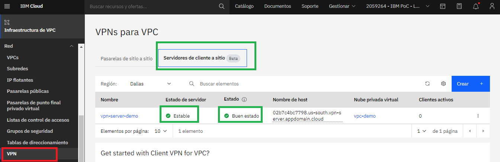
## Crear ruta VPN
   Ingrese a su servidor de VPN y en la pestaña de *Rutas de servidor VPN* dé click en el boton *Crear*. 

   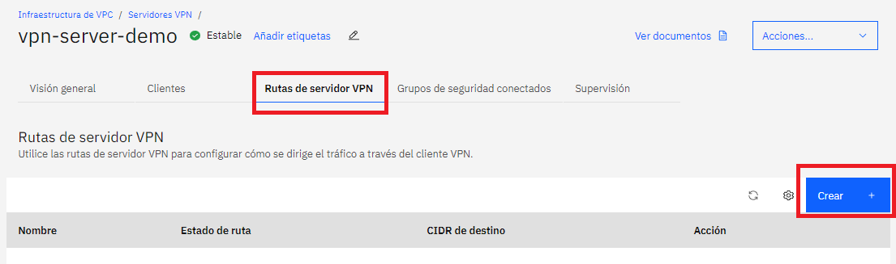

   Luego asígnele un nombre a la ruta y escoja rango CIDR para la red destino:
      - **Para acceso a internet:** Elija 0.0.0.0/0
      - **Para la subred de la VPC:** Ingrese el CIDR de la subred de la VPC.

   Por último escoja la acción de la ruta, en este caso será *Entregar* y finalice dando click en el boton crear.

   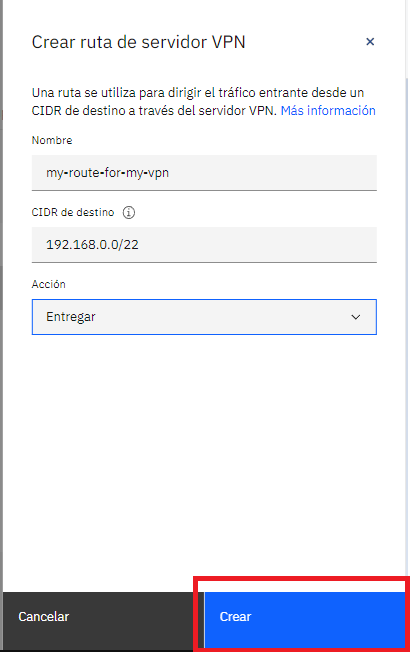

## Configurar Protocolo y reglas de entrada
   En la seccion de grupos de seguridad seleccionar el grupo de seguridad de la VPC y en el apartado de entrada seleccionar el protocolo UDP
   para el puerto 443 con la opción de cualquier origen y la direccion IP 0.0.0.0/0.

   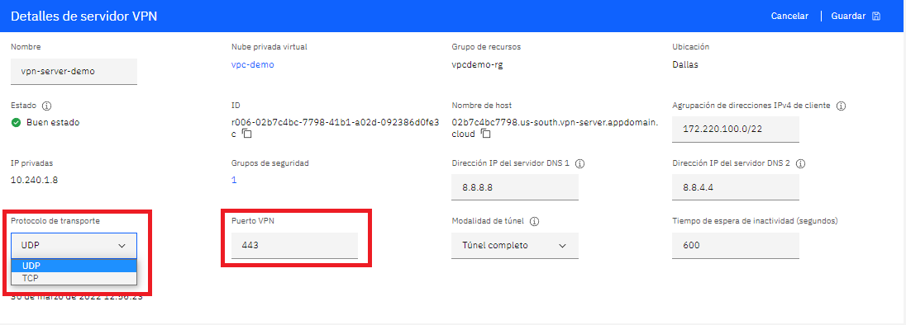

## Configurar el cliente de VPN
   - **Ingrese al servidor de VPN:** En la pestaña cliente dé click *Descargar perfil de cliente*. Descargará un archivo de configuración llamado *<vpn_server>.ovpn*
   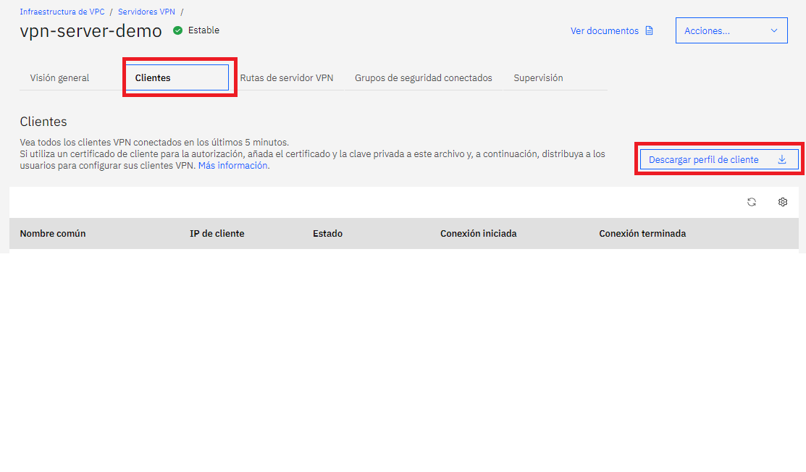

   - **Distribuya el archivo de perfil de cliente:** Envíe el perfil de configuración a los usuarios de la VPN a través de un canal seguro.

   - **Configurar el archivo de perfil de cliente:** Los clientes de la VPN deben editar el perfil de cliente, para esto deben tener los certificados de la VPN, los cuales deben ser enviados por un canal seguro, estos certificados deben ser añadidos al perfil del cliente de la siguiente manera:

   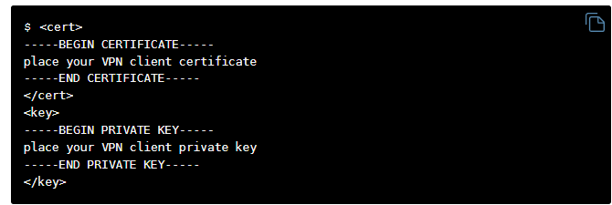

   Para editar el perfil del cliente puede usar un editor de código como *VS CODE* o el de su preferencia y agregar el certificado de cliente que genero al inicio y la private key del certificado al final del archivo perfil del cliente tal como se muestra en la imagen de arriba.

   <br/>
   Una opción alternativa para conectarse al servidor VPN es por medio de un ID de usuario y una contraseña. Para configurar la autenticación en dos factores para usuarios de cliente VPN siga este proceso:

   * El administrador de la VPN invita al usuario del cliente VPN a la cuenta donde reside el servidor VPN.

   * El administrador de la VPN asigna el permiso IAM de usuario de cliente VPN, esto permite al usuario conectarse al servidor VPN. Para más información visite [Creating an IAM access group and granting the role to connect to the VPN server.](https://cloud.ibm.com/docs/vpc?topic=vpc-create-iam-access-group)

   * El usuario de cliente VPN abre la siguiente dirección web para generar una contraseña para su ID de usuario:

   ```
   https://iam.cloud.ibm.com/identity/passcode
   ```

   * El usuario de cliente VPN ingresa su contraseña en el cliente de OpenVPN e inicia la conexión al servidor VPN. Para más información vea [Setting up a client VPN environment and connecting to a VPN server.](https://cloud.ibm.com/docs/vpc?topic=vpc-vpn-client-environment-setup)
   
   <br/>

## Autenticación al servidor VPN

**Por certificado:**
Para conectarse debera importar el perfil de cliente que descargo y configuro en el paso anterior en **Open VPN** y conectarse.


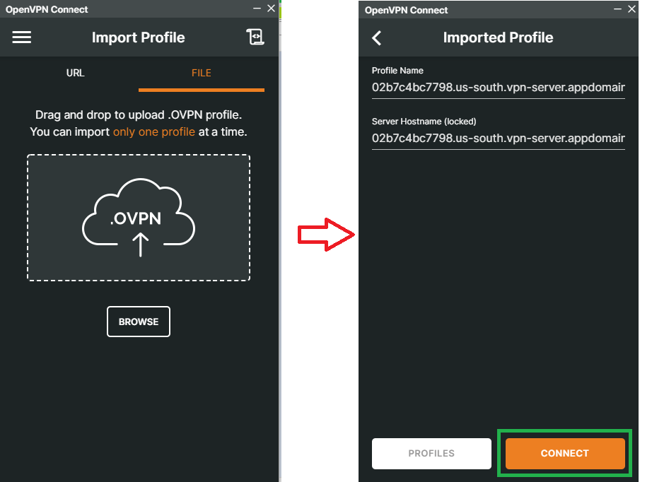

Asi debe lucir su conexión al servidor VPN desde el cliente de **Open VPN**

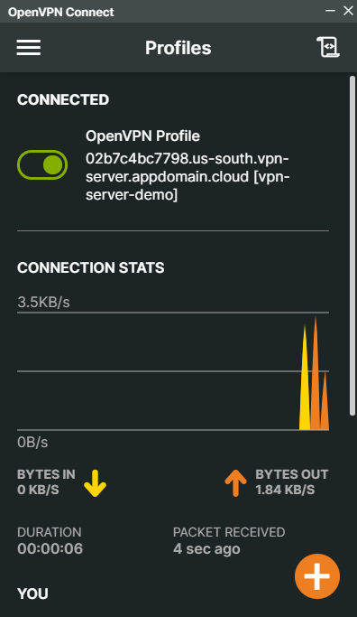


<br/>

**Usuario y contraseña**

Para conectarse usando usuario y contraseña primero debe habilitar la opcion de usuario y codigo de acceso en el apartado de **Autenticación** del servidor VPN. 

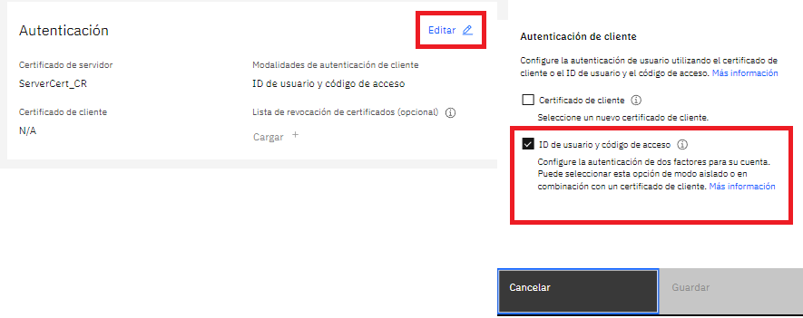

Luego debera importar el perfil de cliente que descargo al cliente de **Open VPN**.

Por ultimo recuerde que su usuario es el mismo que en IBM cloud y tambien debera generar un codigo de acceso para su usuario a traves del siguiente link:

```
   https://iam.cloud.ibm.com/identity/passcode
```
Asi debe lucir su conexión al servidor VPN desde el cliente de **Open VPN**

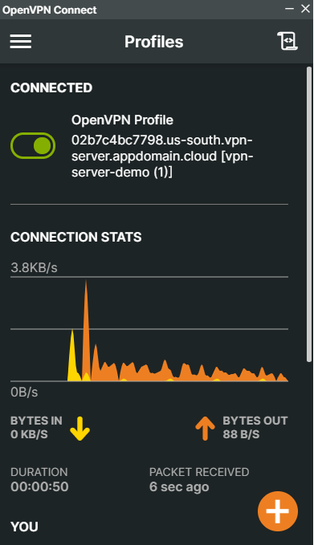

Para verificar que se hizo la conexión adecuadamente, abra la página de detalles del servidor VPN. Luego verifique en la sección de clientes todos los clientes de VPN que se han conectado en a última hora.

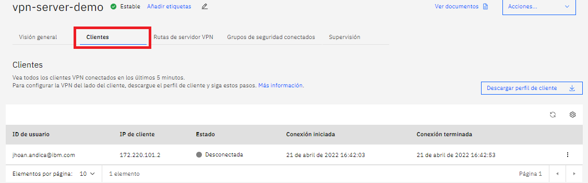

## Referencias :mag:

- [Documentación de IBM Cloud: About client-to-site VPN servers (Beta)](https://cloud.ibm.com/docs/vpc?topic=vpc-vpn-client-to-site-overview)
- [Guía VPC-Despliegue-VSI-Acceso-SSH IBM Colombia](https://github.com/emeloibmco/VPC-Despliegue-VSI-Acceso-SSH)

<br />

## Autores :black_nib:
Equipo *IBM Cloud Tech Sales Colombia*.
