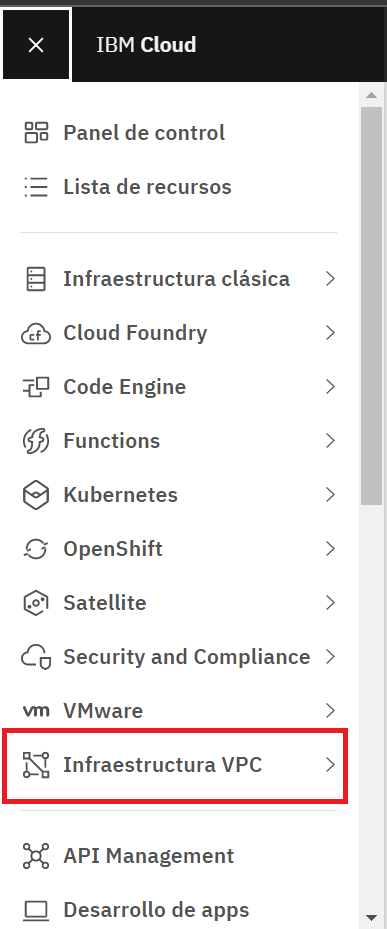
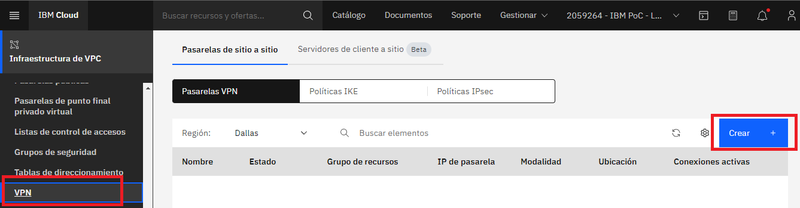
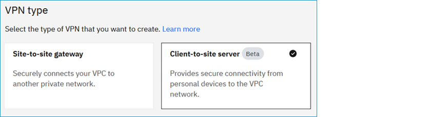
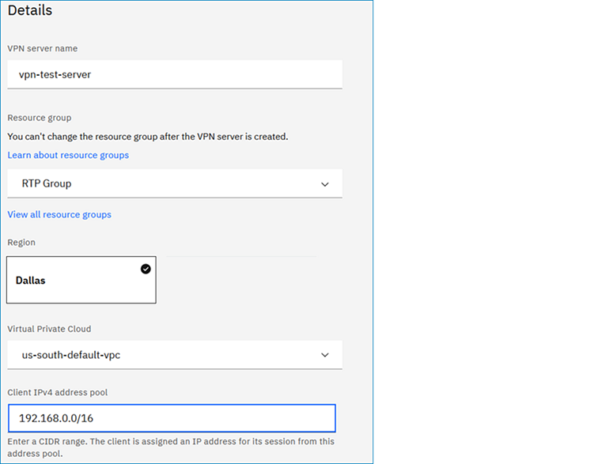
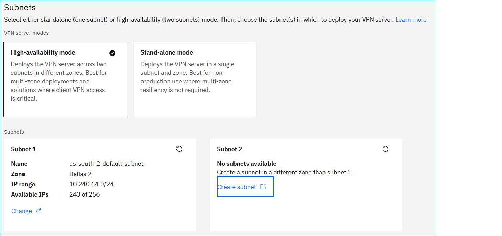
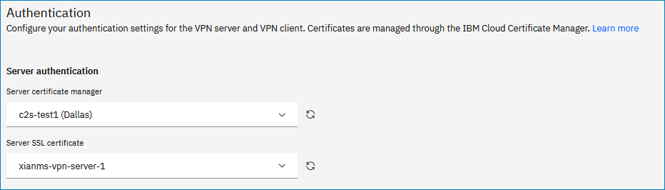
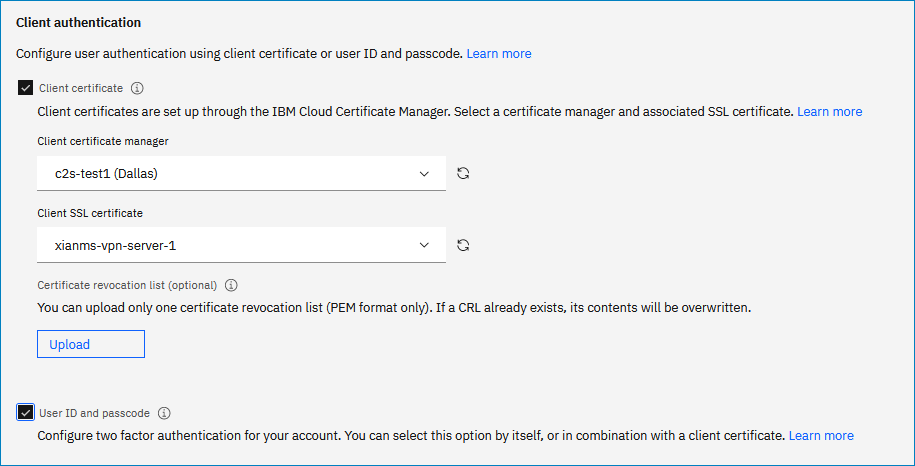
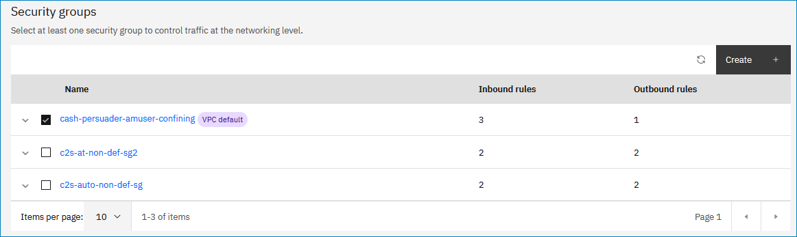
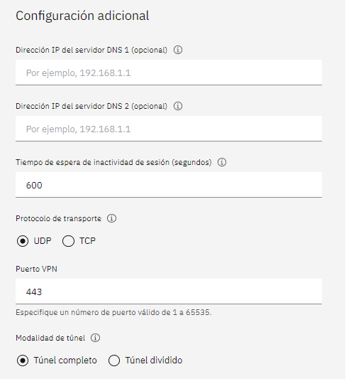

# VPN-for-VPC-Client-to-Site :computer:


<br />

## Tabla de contenido 📑

1. [Requisitos](#Requisitos-newspaper)
2. [Antes de empezar](#antes-de-empezar)
   * [Configuración de la autenticación client-to-site e importación de certificados al Certificate Manager](#configuraci%C3%B3n-de-la-autenticaci%C3%B3n-client-to-site)
   * [Creación del grupo de acceso IAM y rol para conectarse al servidor VPN](#creación-del-grupo-de-acceso-iam-y-rol-para-conectarse-al-servidor-vpn)
   * [Creación de la VPC y la subred](#creación-de-la-vpc-y-la-subred)
3. [creación del servidor VPN](#desplegar-servidor-VPN)
   * [Crear servidor VPN](#crear-servidor-VPN)
   * [Validar servidor VPN]()
   * [Crear ruta VPN]()
   * [Configurar cliente de VPN]()
4. [Conexión al servidor VPN]()
11. [Referencias](#Referencias-mag)
12. [Autores](#Autores-black_nib)
<br />

## Requisitos :newspaper:
- Contar con un sistema operativo Linux con el navegador Google Chrome instalado

- Tener una cuenta de [IBM Cloud](https://cloud.ibm.com/)

- :cloud: [IBM Cloud CLI](https://cloud.ibm.com/docs/cli?topic=cloud-cli-getting-started&locale=en)

- :satellite: [OpenVPN](https://openvpn.net/)
- [Git](https://git-scm.com/downloads)

## Antes de empezar
Inicie sesión en su cuenta de [IBM Cloud](https://cloud.ibm.com/login).
## Configuración de la autenticación client-to-site
**Crear una autorización IAM sevice-to-service**
<br/>
Para crear una autorización IAM sevice-to-service para su servidor VPN y certificate manager siga los siguientes pasos:
1. Desde la consola de IBM Cloud, vaya a la página [Manage Autorizations](https://cloud.ibm.com/iam/authorizations) y dé clic en el botón ```Crear```
2. En el menú desplegable seleccione ```VPC Infrastructure Services``` y luego seleccione ```Resource based on selected attributes```
3. Seleccione ```Resource type``` > ```Client VPN for VPC```
4. En la opción Target Service seleccione ```Certificate Manager```
5. Seleccione la opción ```All resources``` y verifique la casilla ```Writer```
6. Dé clic en ```Authorize```

**Gestión de certificados de cliente y servidor VPN**
<br/>
A continuación se usará [OpenVPN easy-rsa](https://github.com/OpenVPN/easy-rsa) para generar los certificados y posteriormente importarlos al certificate manager.
1. Clone el repositorio Easy-RSA 3 en su carpeta local:
```
git clone https://github.com/OpenVPN/easy-rsa.git
cd easy-rsa/easyrsa3
```
<br/>
2. Cree un nuevo PKI y CA:

```
./easyrsa init-pki
./easyrsa build-ca nopass
```
<br/>

Verifique que el certificado CA esté generado en la ruta ```./pki/ca.crt```

<br/>
3. Genere un certificado de servidor VPN:

```
./easyrsa build-server-full vpn-server.vpn.ibm.com nopass
```

Verifique que la llave pública haya sido generada en la ruta ```./pki/issued/vpn-server.vpn.ibm.com.crt``` y la llave privada en la ruta ```./pki/private/vpn-server.vpn.ibm.com.key```
<br/>

4. Genere un certificado de cliente VPN:
```
./easyrsa build-client-full client1.vpn.ibm.com nopass
```
Verifique que la llave pública haya sido generada en la ruta ```./pki/issued/client1.vpn.ibm.com.crt``` y la llave privada en la ruta ```./pki/private/client1.vpn.ibm.com.key```
<br/>

Para importar los certificados al certificate manager siga estos pasos:
1. En el navegador Google Chrome navegue a la página de [Certificate Manager](https://cloud.ibm.com/catalog/services/certificate-manager), complete la información y dé clic en ```Create``` para crear una instancia.
2. Diríjase a la página ```Your Certificates``` e importe el certificado según los siguientes pasos:

   * Elija un nombre para su certificado, este no puede contener guiones, números ni mayúsculas (ej. vpcdemo)
   * Dé clic al botón ```Browse``` y seleccione el archivo de certificado ```./pki/issued/vpn-server.vpn.ibm.com.crt```
   * Dé clic al botón ```Browse``` y seleccione el archivo de llave privada ```./pki/private/vpn-server.vpn.ibm.com.key```
   * Dé clic al botón ```Browse``` y seleccione el archivo de certificado intermedio ```./pki/ca.crt```
   * Dé clic al botón ```Import```
   <br/>

Si el certificado es usado como certificado de servidor VPN, usted debe subir los archivos ```Certificate file```, ```Private key file``` e ```Intermediate certificate file```. si el certificado es usado como certificado de cliente VPN para autenticar el cliente, usted debe subir los archivos ```Certificate file``` e ```Intermediate certificate file```.
<br/>

**Ordenar un certificado usando Certificate Manager NOTA: creo que esto no lo hicimos Nota 2: No lo hicimos porque es alternativo a generar los certificados, los generas o los ordenas, no los dos al tiempo**
<br/>

Usted puede usar IBM Cloud Certificate Manager para ordenar un certificado público SSL/TLS como certificado de servidor VPN. Certificate Manager solo almacena certificados intermedios, por lo cual usted necesitará los root certificates de Let's Encrypt, guardados como archivos ```.pem```. Los dos archivos requeridos puede encontrarlos en [https://letsencrypt.org/certs/lets-encrypt-r3.pem](https://letsencrypt.org/certs/lets-encrypt-r3.pem) y [https://letsencrypt.org/certs/isrgrootx1.pem](https://letsencrypt.org/certs/isrgrootx1.pem). Cuando descargue y actualice el certificado de cliente VPN, use este root certificate para reemplazar la sección ```<ca>``` en el perfil de cliente.
<br/>

Los certificados ordenados son certificados públicos SSL/TLS y deben ser usados como certificados de servidor VPN únicamente. No pueden ser usados para autenticar los clientes VPN.
<br/>

**Ubicar el certificado CRN NOTA: esto tampoco NOTA 2: se hace en caso de ordener certificados**
<br/>

Al configurar la autenticación de un servidor VPN client-to-site usando la UI, usted puede especificar el Certificate Manager y el certificado SSL, o el CRN del certificado. Esto se puede hacer si usted no tiene acceso a la instancia de Certificate Manager. Tenga en cuenta que usted debe ingresar el CRN si está usando la API para crear el servidor VPN client-to-site.
<br/>
Para encontrar el CRN del certificado, siga estos pasos:

1. En la [consola de IBM Cloud](https://cloud.ibm.com/vpc-ext) Vaya al ícono de menú y seleccione ```Resource List```
2. Dé clic para expandir ```Services and software``` y posteriormente seleccione el Certificate Manager del que desea obtener el CRN.
3. Seleccione cualquier parte en esa fila de la tabla para abrir el panel lateral de detalles. El CRN del certificado se encuentra listado allí.

**Configuración de IDs de usuario y contraseñas NOTA: no lo hicimos, NOTA2: no lo hicimos porque intentamos conectarnos al vpn con certificados**
<br/>

Para configurar la autenticación en dos factores para usuarios de cliente VPN siga este proceso:

1. El administrador de la VPN invita al usuario del cliente VPN a la cuenta donde reside el servidor VPN.

2. El administrador de la VPN asigna el permiso IAM de usuario de cliente VPN, esto permite al usuario conectarse al servidor VPN. Para más información visite [Creating an IAM access group and granting the role to connect to the VPN server.](https://cloud.ibm.com/docs/vpc?topic=vpc-create-iam-access-group)

3. El usuario de cliente VPN abre la siguiente dirección web para generar una contraseña para su ID de usuario:

```
https://iam.cloud.ibm.com/identity/passcode
```

4. El usuario de cliente VPN ingresa su contraseña en el cliente de OpenVPN e inicia la conexión al servidor VPN. Para más información vea [Setting up a client VPN environment and connecting to a VPN server.](https://cloud.ibm.com/docs/vpc?topic=vpc-vpn-client-environment-setup)

## Creación del grupo de acceso IAM y rol para conectarse al servidor VPN

Para crear un grupo de acceso IAM y permitir al rol de usuario conectarse al servidor VPN, siga estos pasos:

1. Desde la consolda de IBM Cloud, navegue a la página de [Access groups](https://cloud.ibm.com/iam/groups) (Manage > Access (IAM) > Access groups) y dé clic en ```Create```.
2. Digite un nombre para su grupo de acceso y dé clic en ```Create```.
3. Dé clic en la pestaña ```Access Policies``` y luego en ```Assign access```.
4. En el menú desplegable seleccione ```VPC Infrastructure Services```.
5. Para acceso al servicio, seleccione ```Users of the VPN server need this role to connect to the VPN server``` y luego dé clic en ```Add```
6. Verifique el panel de resumen y dé clic en ```Assign```.
7. Dé clic en la pestaña ```Users``` y posteriormente en ```Add users``` para agregar usuarios al nuevo grupo de acceso.

## Creación de la VPC y la subred

**Creación de la VPC NOTA: está en español**
<br/>
Para crear una VPC en su cuenta de IBM Cloud siga los pasos que se indican a continuación:

1. Dé click en el ```Menú de Navegación``` y seleccione la pestaña ```Infraestructura VPC```.

2. En la sección de ```Red``` seleccione la opción ```VPCs``` y posteriormente de click en el botón ```Crear```. Una vez le aparezca la ventana para la configuración y creación de la *VPC*, complete lo siguiente:

* ```Nombre```: asigne un nombre exclusivo para la *VPC*.
* ```Grupo de recursos```: seleccione el grupo de recursos en el cual va a trabajar.
* ```Ubicación```: seleccione la ubicación en la cual desea implementar la *VPC*.


| NAME | DISPLAY NAME |
| ------------- | :---: |
| au-syd        | Sydney          |     
| in-che        | Chennai         |     
| jp-osa        | Osaka           |     
| jp-tok        | Tokyo           |     
| kr-seo        | Seoul           |     
| eu-de         | Frankfurt       | 
| eu-gb         | London          | 
| ca-tor        | Toronto         |     
| us-south      | Dallas          | 
| us-south-test | Dallas Test     |
| us-east       | Washington DC   |
| br-sao        | Sao Paulo       |

* ```Grupo de seguridad predeterminado```: deje seleccionadas las opciones *Permitir SSH* y *Permitir ping*.
* ```Acceso clásico```: deje el campo SIN seleccionar.
* ```Prefijos de dirección predeterminados```: deje el campo SIN seleccionar, ya que posteriormente se creara la subred en la que se va a trabajar.

Cuando ya tenga todos los campos configurados de click en el botón ```Crear nube privada virtual```.

3. Espere unos minutos mientras la *VPC* aparece en estado disponible y asegúrese de tener seleccionada la región en la cual la implementó.
4. Una vez haya sido aprovisonada la VPC, de click en el nombre e ingrese a la pestaña ```Prefijos de dirección```. En dicha pestaña, de click en ```Crear``` e ingrese la dirección IP que desee junto con la máscara.

> NOTA: Puede utilizar la IP y máscara sugeridas en las subnets creadas por defecto cuando se estaba aprovisionando la VPC.

<br />

**Creación de la subnet NOTA: también está en español**
<br />
El siguiente paso consiste en crear un Subred en la *VPC*. Para ello, en la sección de ```Red``` seleccione la opción ```Subredes``` y de click en el botón ```Crear```. Una vez le aparezca la ventana para la configuración y creación de la subred, complete lo siguiente:

* ```Nombre```: asigne un nombre exclusivo para la subred.
* ```Grupo de recursos```: seleccione el grupo de recursos en el cual va a trabajar (el mismo seleccionado en la creación de la *VPC*).
* ```Ubicación```: seleccione la ubicación en la cual desea implementar la subred (la misma seleccionada en la creación de la *VPC*).
* ```Nube privada virtual```: seleccione la *VPC* que creó anteriormente.
* Los demás parámetros no los modifique, deje los valores establecidos por defecto.

Cuando ya tenga todos los campos configurados de click en el botón ```Crear subred```.

6. Espere unos minutos mientras la subred aparece en estado disponible y asegúrese de tener seleccionada la región en la cual la implementó.

<br />

**Configurar claves SSH :closed_lock_with_key: NOTA: está en español**
<br />
Para poder desplegar una *VSI* en *VPC* es necesario realizar la respectiva configuración para las claves *SSH*. En base a esto, realice lo siguiente:

1. Para generar una clave *SSH* acceda al *IBM Cloud Shell* y coloque el comando:
```
ssh-keygen -t rsa -C "user_id"
```

2. Al colocar el comando anterior, en la consola se pide que especifique la ubicación, en este caso oprima la tecla Enter para que se guarde en la ubicación sugerida. Posteriormente, cuando se pida la ```Passphrase``` coloque una constraseña que pueda recordar o guardela, ya que se utilizará más adelante.

3. Muévase con el comando ```cd .ssh``` a la carpeta donde están los archivos ```id_rsa.pub``` y ```id_rsa```. Estos archivos contienen las claves públicas y privadas respectivamente. 

4. Visualice la clave pública, ya que la necesitara para la creación de la *VSI*. Utilice el comando:
```
cat id_rsa.pub
```
> NOTA: Por defecto la clave empieza con ssh_rsa y termina con el user_ID. Copie la clave para emplearla más adelante.

<br />

**Desplegar VSI en VPC**
<br/>
Un vez ha configurado las claves *SSH* proceda con la creación de la *VSI* Linux en *VPC*. Complete los siguientes pasos:

1. En la sección de ```Computación``` seleccione la opción ```Instancias de Servidor Virtual``` y posteriormente de click en el botón ```Crear```. Una vez le aparezca la ventana para la configuración y creación de la *VSI*, complete lo siguiente:

* ```Nombre```: asigne un nombre exclusivo para la *VSI*.
* ```Grupo de recursos```: seleccione el grupo de recursos en el cual va a trabajar (el mismo seleccionado en la creación de la *VPC*).
* ```Ubicación```: seleccione la ubicación en la cual desea implementar la subred (la misma seleccionada en la creación de la *VPC*).
* ```Tipo de servidor virtual```: seleccione la opción **Público**.
* ```Sistema operativo```: seleccione la opción **Ubuntu Linux**.
* ```Perfil```: deje seleccionado el perfil que viene por defecto (**Equilibrado | bx2-2x8**).
* ```Claves SSH```: de click en el botón ```Clave nueva +```, asigne un nombre exclusivo para su clave *SSH*, seleccione el grupo de recursos y la ubicación y finalmente en **Clave pública** coloque la clave copiada en el ítem 3 del paso [Configurar claves SSH](#Configurar-claves-SSH-closed_lock_with_key). Posteriormente, de click en el botón ```Añadir clave SSH```.
* ```Nube privada virtual```: seleccione la *VPC* creada anteriormente.
* Los demás parámetros no los modifique, deje los valores establecidos por defecto.

Cuando ya tenga todos los campos configurados de click en el botón ```Crear instancia de servidor virtual```.

2. Espere unos minutos mientras la *VSI* aparece en estado disponible y asegúrese de tener seleccionada la región en la cual la implementó.

<br />


## Desplegar servidor VPN
Dirigase al Panel en la parte izquierda de IBM Cloud y seleccione *Infraestructura VPC*


## <h3>Crear servidor VPN</h3>
   Ahora en seleccionamos el apartado de VPN y damos click en el boton de crear.

   

   Luego seleccionamos el tipo de VPN que deseamos, en este caso *Client-to-site-server*.

   

   En la seccion de detalles, se debe especificar la siguiente informacion:

   - **Nombre del servidor de VPN:** Escoge un nombre para tu servidor VPN, ejemplo: my-vpn-server.<br/>
   - **El grupo de recursos:** El grupo de recursos que seleccionas debe ser el mismo que en donde se encuentra la VPC.
   - **Region:** La misma region donde se encuentra la VPC se usara para el servidor de VPN.
   - **Virtual private cloud:** Escoger la VPC para el servidor de VPN.
   - **Client IPv4 address pool:** Ingrese un rango CIDR. Al cliente se le asigna una IP de este rango para su sesion.

   

   Ahora en la seccion de subredes, se debe seleccionar la modalidad del servidor VPN:

   - **Seleccionar la modalidad del servidor VPN:**
      - **Modo de alta disponibilidad:** Este modo despliega el servidor en dos subredes que se encuentran ubicadas en diferentes zonas.Ideal para los despliegues y soluciones donde el acceso VPN de el cliente es crucial.
      -**Modalidad autonoma:** Este modo despliega el servidor de VPN en una subred en una sola zona. Ideal para despliegas en una sola zona.

      
   - **Seccion de autenticacion:** 
      - **Autenticacion del servidor:** Selecciona el gestor de certificados y luego el certificado SSL del servidor.

      

      - **Autenticacion del cliente:** Se debe seleccionar que configuracion usara el cliente para autenticarse en el servidor, ya sea a traves de certificados o usando un ID y passcode, o ambas si se desea.

      

   - **Seccion grupos de seguridad:** Debes seleccionar al menos un grupo de seguridad.Tambien puede configurar mas grupos de seguridad si lo desea.

   

   - **Configuracion adicional:** Mantenga la configuracion recomendada.

   
      
   

## Referencias :mag:

- [Documentación de IBM Cloud: About client-to-site VPN servers (Beta)](https://cloud.ibm.com/docs/vpc?topic=vpc-vpn-client-to-site-overview)
- [Guía VPC-Despliegue-VSI-Acceso-SSH IBM Colombia](https://github.com/emeloibmco/VPC-Despliegue-VSI-Acceso-SSH)

<br />

## Autores :black_nib:
Equipo *IBM Cloud Tech Sales Colombia*.
